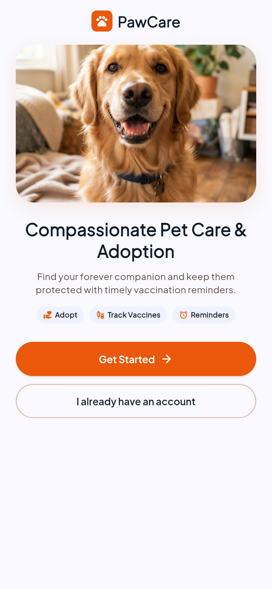
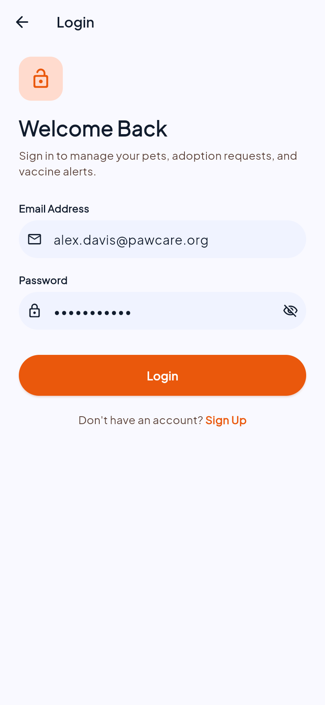
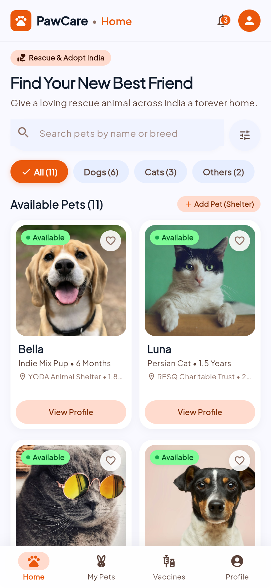
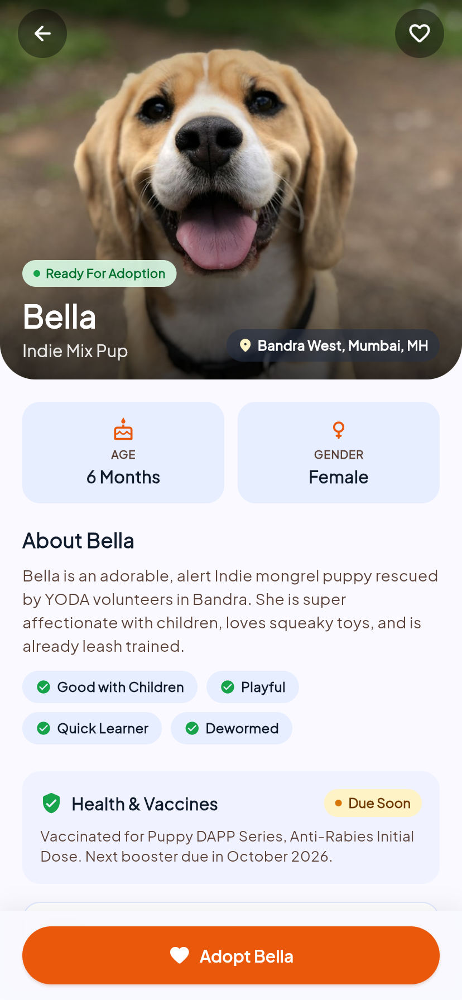
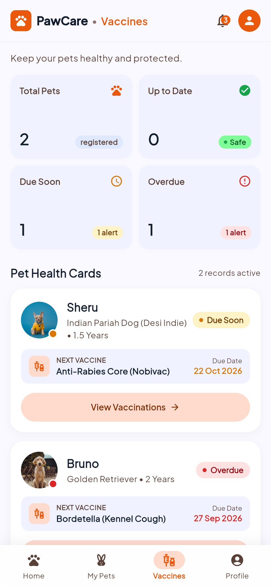
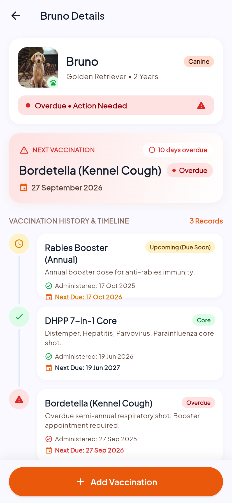
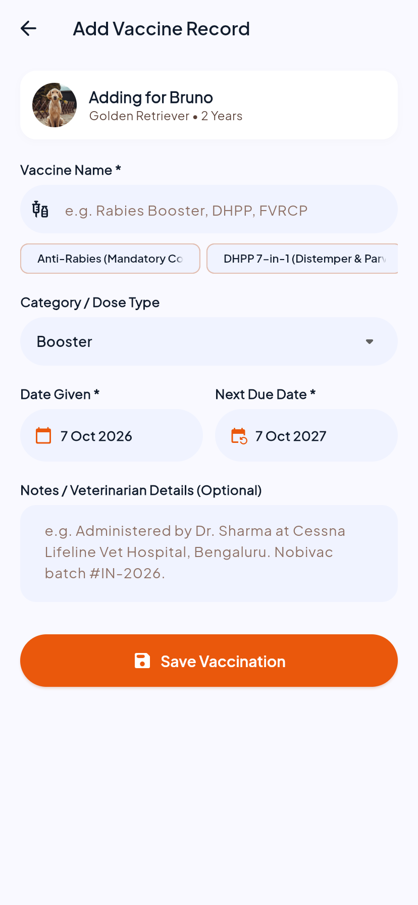
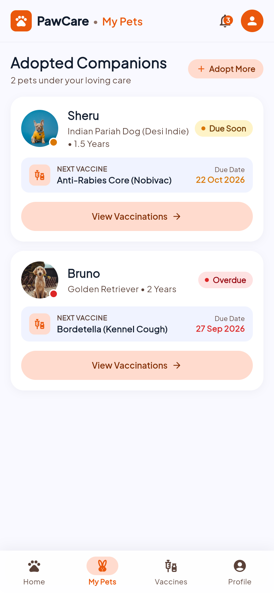
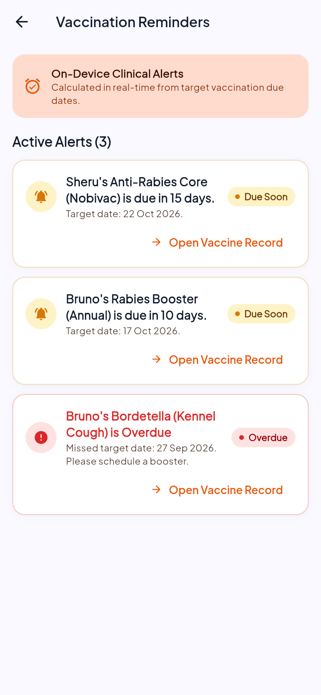

# PawCare – Pet Adoption & Intelligent Vaccination Reminder App

<div align="center">
  
  <h3>Compassionate Pet Care, Seamless Rescue Adoption & Clinical Vaccination Tracking</h3>

  [](https://flutter.dev)
  [](https://dart.dev)
  [](https://m3.material.io)
  []()
  []()
  []()
</div>

---

## 🌟 Overview

**PawCare** is a production-grade, cross-platform mobile application engineered in **Flutter & Dart**. It empowers animal lovers to discover and adopt rescue animals across India while offering pet parents an intelligent, automated clinical vaccination tracker.

The application follows the **Google Stitch (Material 3 Warm Pet Wellness)** design system, featuring warm organic color palettes, accessible typography, elevation shadows, and fluid micro-interactions.

---

## 📱 Live In-App Screenshots

<div align="center">
  <table>
    <tr>
      <td align="center"><b>01. Welcome & Onboarding</b></td>
      <td align="center"><b>02. User Authentication</b></td>
      <td align="center"><b>03. Pet Discovery Feed</b></td>
    </tr>
    <tr>
      <td></td>
      <td></td>
      <td></td>
    </tr>
    <tr>
      <td align="center"><b>04. Pet Bio & Adoption</b></td>
      <td align="center"><b>05. 4-Metric Vaccine Tracker</b></td>
      <td align="center"><b>06. Clinical Vaccine Timeline</b></td>
    </tr>
    <tr>
      <td></td>
      <td></td>
      <td></td>
    </tr>
    <tr>
      <td align="center"><b>07. Add Vaccination Modal</b></td>
      <td align="center"><b>08. Adopted Companions</b></td>
      <td align="center"><b>09. Clinical Reminders Hub</b></td>
    </tr>
    <tr>
      <td></td>
      <td></td>
      <td></td>
    </tr>
  </table>
</div>

---

## 🚀 Key Features

- 🐾 **Pet Discovery & Adoption Catalog**:
  - Live filtering by category: **Dogs**, **Cats**, **Others (Bunnies, Birds)**, and **All**.
  - Instant search across pet names, breeds, shelter names, and locations.
  - Interactive pet profile cards with age, distance tags, and health status indicators.
- 💉 **Dynamic Conditional Vaccination Engine**:
  - Pure date arithmetic dynamically computes health status in real-time without stale flags:
    - 🟢 **UP TO DATE**: Next dose is > 30 days away.
    - 🟡 **DUE SOON**: Next dose is within 0 to 30 days.
    - 🔴 **OVERDUE**: Next dose date has passed.
  - Multi-vaccine aggregated status computation for pet-level health summaries.
- 📊 **4-Metric Vaccination Command Center**:
  - Real-time dashboard with counters for **Total Pets**, **Up to Date**, **Due Soon**, and **Overdue**.
- ⏱️ **Clinical Timeline & Hero Countdown**:
  - Exact day counter (e.g. `10 days overdue`, `15 days remaining`).
  - Historical chronological timeline linking previous doses with clinic verification notes.
- 📋 **Vaccine Administration Logging**:
  - Pre-configured with clinical vaccines: **Anti-Rabies Core (Nobivac)**, **DHPP 7-in-1**, **DHPPiL 9-in-1**, **Bordetella**, and **FVRCP Tricat**.
  - Custom date pickers and dose type selectors (Core, Booster, Initial Immunization).
- 🏠 **Shelter Rescue Intake Portal**:
  - Animal shelters can publish rescue listings with photo avatars, bio details, and initial vaccine records.
- 🔔 **Proactive In-App Alert System**:
  - Real-time badge counter on the top app bar reflecting active high-priority vaccine reminders.
- 💾 **100% On-Device Local Persistence**:
  - Fast, offline-first data caching with structured JSON serialization over `SharedPreferences`.
- 🔐 **Authentication & Session Management**:
  - Secure on-device login/registration with optional Firebase Auth integration.

---

## 🏗️ Architecture & Project Structure

```
PawCare/
├── lib/
│   ├── main.dart                                     # Application entry point & route dispatcher
│   ├── theme/
│   │   └── app_theme.dart                            # Centralized Stitch design tokens & M3 palette
│   ├── models/
│   │   ├── enums.dart                                # AdoptionStatus, VaccinationStatus, PetGender, PetCategory
│   │   ├── user.dart                                 # User model with JSON serialization
│   │   ├── vaccination.dart                          # Clinical vaccination record model
│   │   └── pet.dart                                  # Comprehensive Pet model with nested history
│   ├── utils/
│   │   └── vaccination_utils.dart                    # Pure dynamic Dart calculation algorithms
│   ├── services/
│   │   ├── local_storage_service.dart                # Structured SharedPreferences JSON persistence
│   │   ├── auth_service.dart                         # Authentication, session & Firebase bridge
│   │   └── pet_service.dart                          # Adoption flow, catalog & metric aggregations
│   ├── widgets/
│   │   ├── app_header.dart                           # Top app bar with notifications badge & avatar
│   │   ├── status_badge.dart                         # Dynamic M3 status pills (Up to Date, Due Soon, Overdue)
│   │   ├── primary_button.dart                       # Primary gradient & tonal button system
│   │   ├── custom_search_bar.dart                    # Live search bar & category filters
│   │   ├── pet_card.dart                             # 2-column discovery card & companion cards
│   │   ├── vaccination_card.dart                     # 4-grid metrics dashboard & timeline card
│   │   └── empty_state_view.dart                     # Actionable empty state placeholders
│   └── screens/
│       ├── splash/splash_screen.dart                 # Animated splash screen
│       ├── welcome/welcome_screen.dart               # Hero welcome & value proposition
│       ├── auth/
│       │   ├── login_screen.dart                     # Login with input validation
│       │   └── signup_screen.dart                    # User registration
│       ├── main_navigation_screen.dart               # M3 Bottom navigation shell
│       ├── home/home_screen.dart                     # Available pets discovery catalog
│       ├── pet_profile/pet_profile_screen.dart       # Full pet bio & adoption modal
│       ├── adoption/adoption_success_screen.dart     # Celebratory confetti confirmation
│       ├── my_pets/my_pets_screen.dart               # Adopted companions overview
│       ├── vaccinations/
│       │   ├── vaccination_tracker_screen.dart       # 4-metric tracker & pet health list
│       │   └── pet_vaccination_details_screen.dart   # Next vaccination countdown & timeline
│       ├── add_vaccination/add_vaccination_screen.dart# Clinical intake form with quick-select chips
│       ├── reminders/vaccination_reminders_screen.dart# Priority clinical reminder alerts
│       ├── shelter/shelter_add_pet_screen.dart       # Shelter animal listing form
│       └── profile/profile_screen.dart               # User profile & shortcuts
├── backend/                                          # Node.js Firebase Admin SDK Module
│   ├── src/
│   │   ├── notifications.js                          # FCM push notification dispatcher
│   │   ├── dataManager.js                            # Firestore administrative data manager
│   │   └── firebaseAdmin.js                          # Admin SDK credential initialization
│   └── package.json
├── screenshots/                                      # Captured high-resolution app screenshots
├── test/
│   ├── pawcare_test.dart                             # Comprehensive unit tests for logic & services
│   └── widget_test.dart                              # Widget rendering tests
├── PROJECT_REPORT.md                                 # Full academic & technical report
└── pubspec.yaml                                      # Project dependencies & metadata
```

---

## ⚡ Quick Start

### Prerequisites
- [Flutter SDK](https://flutter.dev/docs/get-started/install) (version 3.13.0 or higher)
- [Dart SDK](https://dart.dev) (version 3.13.0 or higher)
- Google Chrome (for Web) or Android/iOS emulator

### Installation & Launch

```bash
# 1. Clone the repository
git clone https://github.com/BankimKamila185/PawCare.git
cd PawCare

# 2. Install Flutter packages
flutter pub get

# 3. Launch on Web (Chrome)
flutter run -d chrome

# 4. Launch on Android / iOS
flutter run
```

---

## 🧪 Testing & Verification

PawCare includes an exhaustive test suite covering dynamic date arithmetic, local persistence, adoption transitions, and widget rendering.

```bash
# Run static code analysis
flutter analyze

# Execute all test suites
flutter test
```

**Test Suite Coverage:**
```
00:00 +0: VaccinationUtils Dynamic Calculation Tests Calculates OVERDUE when nextDueDate is before today
00:00 +1: VaccinationUtils Dynamic Calculation Tests Calculates DUE SOON when nextDueDate is within 30 days
00:00 +2: VaccinationUtils Dynamic Calculation Tests Calculates UP TO DATE when nextDueDate is more than 30 days away
00:00 +3: VaccinationUtils Dynamic Calculation Tests Calculates overall pet status as OVERDUE if any vaccine is overdue
00:00 +4: VaccinationUtils Dynamic Calculation Tests Calculates days remaining accurately
00:00 +5: PetService & Local Persistence Tests Initializes with seed pets
00:00 +6: PetService & Local Persistence Tests Adopting moves pet from Available to My Pets and persists
00:00 +7: PetService & Local Persistence Tests Adding a vaccination record updates history and persists
00:00 +8: PetService & Local Persistence Tests Shelter can add a new pet and it appears in available pets
00:00 +9: PetService & Local Persistence Tests Searching and filtering pets works locally
00:00 +10: PetService & Local Persistence Tests Data survives service re-instantiation simulating app restart
00:00 +11: PawCareApp renders successfully and loads initial state
00:02 +15: All tests passed!
```

---

## 📄 Technical Report
For detailed mathematical formulations, system design diagrams, security considerations, and clinical schedules, refer to the [PROJECT_REPORT.md](file:///Users/bankimkamila/Flutter%20petcare/PROJECT_REPORT.md).

---

## 📜 License
This project is developed for educational, semester presentation, and academic demonstration purposes.
